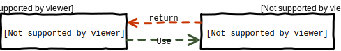

# Time to come out!

[New look](https://scikit-learn.org) and [new features](https://scikit-learn.org/stable/whats_new/v0.22.html) for this 0.22
scikit-learn release.
Just a bit earlier than Santa visiting, this past month some unusual Elves have worked really hard to
keep the target of releasing scikit-learn twice a year.

Come take a look together at some of the many suprises this special package contains.

## With big data come big responsibilities
_New features for [plotting](https://scikit-learn.org/stable/auto_examples/release_highlights/plot_release_highlights_0_22_0.html#new-plotting-api) and [interpretability](https://scikit-learn.org/stable/whats_new/v0.22.html#sklearn-inspection)_

Models fitted by Machine Learning algorithms need to be interpreted and well understood if they have to be applied at
a large scale and trusted by users.

Visualisation is an important step of data analysis and an essential one to the understanding of your dataset.
It allows to have a first insight into the data and provides suggestions on which methods are suitable to a deeper investigation.
The 0.22 scikit-learn version defines a simple API for visualisation.
The key feature of [this API](https://scikit-learn.org/stable/visualizations.html) is to allow for quick plotting and visual
adjustments without recalculation.
For each available plotting function a correspondent object is defined storing the necessary information to be graphically 
rendered.

Interpretability defines the level of comprehension we have of a general model and of its application to a dataset.  
Dive deeper into interpretability of the fitted model makes Machine Learning more understandable.
This was also a [recommendation from the Partners](https://scikit-learn.fondation-inria.fr/technical-committee-july-4-2019/#inspection)
of the scikit-learn Consortium.
The 0.22 version improves the [`inspection`](https://scikit-learn.org/stable/modules/classes.html#module-sklearn.inspection)
module.
A new feature, the [permutation feature importance](https://scikit-learn.org/stable/modules/generated/sklearn.inspection.permutation_importance.html#sklearn.inspection.permutation_importance), has been added.
It measures how the score of a specific model decreases when a feature is not available.
The permutation importance is calculated on the training set to show how much the model relies on each feature during training.

Also [Partial Dependency analysis](https://scikit-learn.org/stable/modules/generated/sklearn.inspection.partial_dependence.html#sklearn.inspection.partial_dependence)
has been improved in particular increasing interoperability with Pandas objects and the new plotting capabilities.

## Left Out Some Data?
_Improvements in missing data management_

When dealing with big amount of data there are just as big chances that some entries are incomplete.
Multiple reasons, from instrument failures to bad format conversions to human errors, could be the causes of missing values in
the dataset.
Ideally, Machine Learning algorithm would know what to do with them.
When this is not the case a number of so-called imputation algorithms could be used to make assumptions on the missing data.

For scikit-learn, version 0.22 brings the `HistogramGradientBooster` algorithm to
[manage missing data](https://scikit-learn.org/stable/auto_examples/release_highlights/plot_release_highlights_0_22_0.html#native-support-for-missing-values-for-gradient-boosting) without need of any imputing.

For those estimators that still need missing data to be imputed the `impute` module has now a new [k-Nearest Neighbors](https://en.wikipedia.org/wiki/K-nearest_neighbors_algorithm) imputer, for which a Euclidean distance has been defined in the
`metric` module taking missing values into account.

## Harvesting and Picking
_[fetch_openml improvements](https://scikit-learn.org/stable/auto_examples/release_highlights/plot_release_highlights_0_22_0.html#retrieve-dataframes-from-openml) and [Pandas](https://pandas.pydata.org/) interoperability_

Big amount of data needs to be efficiently and accurately manipulated: interoperability is the key for a safe data mining.
No matter which software you are using, format and structure manipulations need to be automatised and user do not have to care
about that.
Pandas is a principal actor of the big data ecosystem: scikit-learn 0.22 improves input and output interoperability with
pandas on a method by method basis.
In particular [fetch_openml](https://scikit-learn.org/stable/modules/generated/sklearn.datasets.fetch_openml.html#sklearn.datasets.fetch_openml)
can now return pandas dataframe and thus properly handle datasets with heterogeneous data.

## We value our privacy
_[Clear definition of the public API](https://scikit-learn.org/stable/whats_new/v0.22.html#clear-definition-of-the-public-api)_

Even if in Python there is no really private objects and methods, this 0.22 version aims to clean the public API space.
Be aware that this could change some of your import.
Private API are not meant to be documented and you should not rely on their stability.

## Let's behave!
_[stick to python deprecation recommendations](https://scikit-learn.org/stable/whats_new/v0.22.html#deprecations-using-futurewarning-from-now-on)_

Managing logs is not an obvious task: if you are in a production or development environment, if you are managing a lot of
dependencies or just running a small script, you may want to monitor different behaviours, looking for different levels of
verbosity.
Python defines a [standard behaviour](https://docs.python.org/3/library/warnings.html#warning-categories) for warnings, defining
also the level of the [warning filter](https://docs.python.org/3.7/library/warnings.html#the-warnings-filter) needed to avoid 
them. 
The scikit-learn approach has always been to make the user aware of object deprecations, as the code could be update as soon as
possible to avoid future failures.
But this was done in a non standard way, overriding user preferences in the `__init__.py` file.

Our Elves received some [coal](https://github.com/scikit-learn/scikit-learn/issues/11792) in the past for this.
They are happy to share that scikit-learn 0.22 is compliant with Python recommendation.
Deprecations are now identified with `FutureWarnings`, always thrown in the Python scheme.

## Need more?
The 0.22 release comes with a lot more of improvements and bug fixes.
Check the [Changelog](https://scikit-learn.org/stable/whats_new/v0.22.html) to have them in a glance.
As often, choices have to be made and compromises between the amazing feature you would have been happy to see in
the code and the time availability of a community based project: so, please don't be too upset if your Santa's list is not 
completely covered.

The Elves are  already working on the next step ... to [0.23](https://github.com/scikit-learn/scikit-learn/milestones/0.23) ... 
and [beyond](https://github.com/scikit-learn/scikit-learn/issues/14386)!
